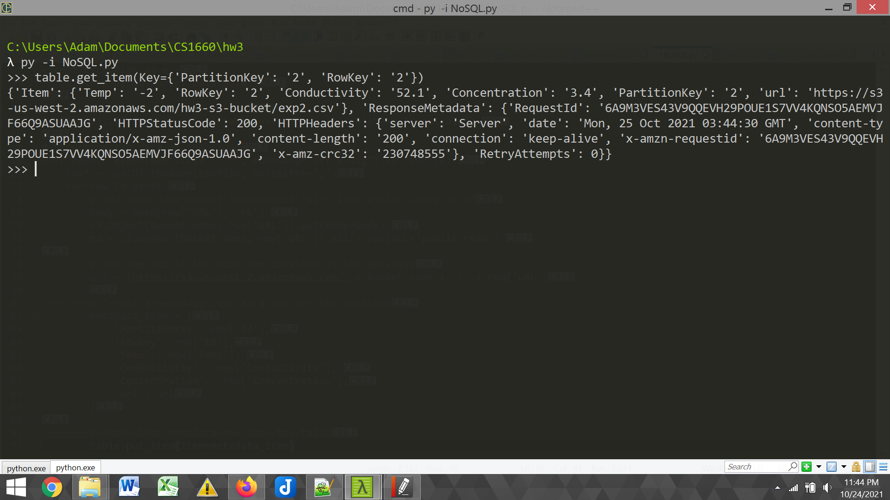

# CS1660_HW3
University of Pittsburgh CS 1660 Cloud Computing Homework 3 involving NoSQL and Amazon Web Services

## Notes

The code for creating the database and blobs are all contained within [NoSQL.py](NoSQL/NoSQL.py). To avoid putting private credentials on a public repository, it assumes a file named `aws_credentials.txt` exists in the directory with access key on the first line and the secret key on the second line. By running `python -i NoSQL.py`, we can use the existing DynamoDB object and query the database without having to re-enter anything.

## Query Screenshot

